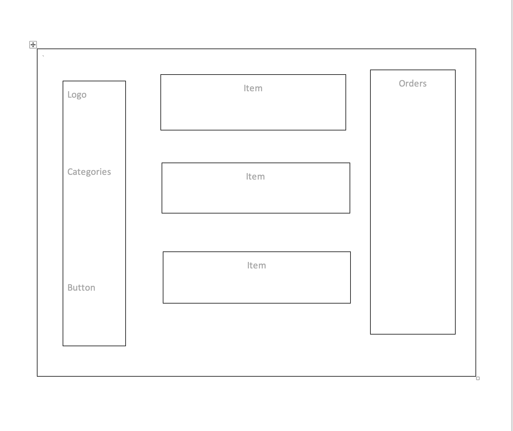
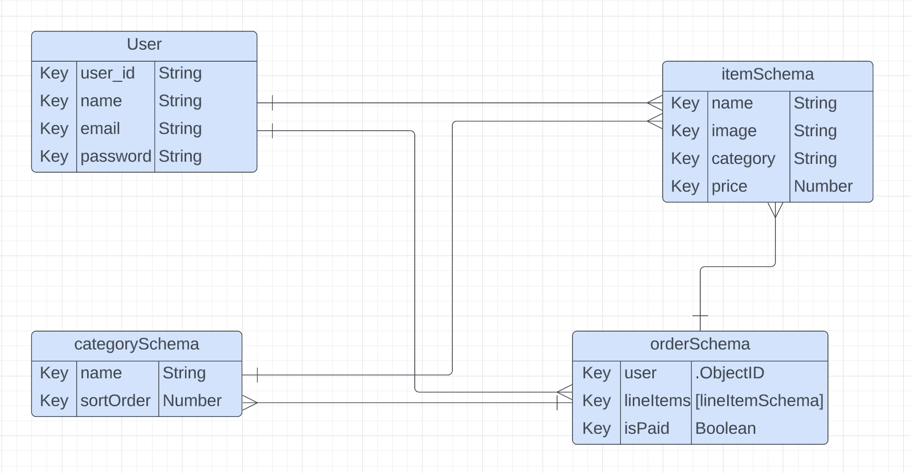

# Coffee Shop

### Resourses ###

Trello: https://trello.com/b/uGdyJIFH/coffee-shop
  

 

### Technologies used: ###

CRUD, REST, JSX, React, Express, Mongoose, MongoDB, HTML, CSS, SCSS, JavaScript

 

### Wireframes ###
 

 

### ERD ###
 

 

 

### Next Steps ###

1. Add the Landing page with dropdown menu of multiple pages selection
2. Add About Page and Contact Us Page
3. Add the button to delete the order 
4. Implement the payment API 